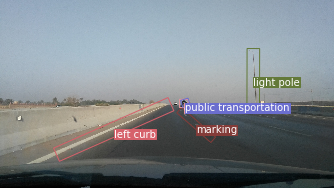
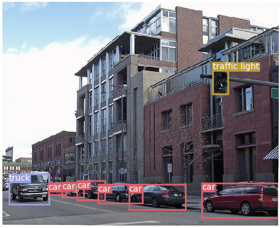
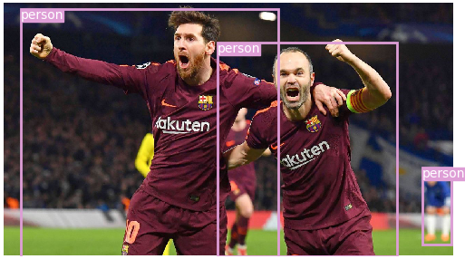

# Efficient Oriented Object Detection with YOLO (Sin(2θ)-Cos(2θ) encoding based on YOLOv3)

> **Cite our Work:**
> 
> Hesham M. Eraqi et al. Automatic Roadway Features Detection with Oriented Object Detection. Journal of Intelligent Transportation Systems. Applied Sciences (ISSN 2076-3417), 11(8), 2021.

Data Annotation Tool for oriented objects (with Mouse right click): https://github.com/heshameraqi/labelImg_OBB
Get the model checkpoint from: https://drive.google.com/file/d/13XZCTY5FSHIOMsWjiKbhM1MBqWNHtO07/view?usp=sharing
Dataset download link: https://drive.google.com/file/d/1N3Q8Rehgyxjc7wwpKR3UA9MXndhs80o0/view?usp=sharing
Based on the YOLOv3 implementation: Minimal implementation of YOLOv3 in PyTorch upgraded to support oriented bounding boxes detection (OBB).

[]([https://www.youtube.com/watch?v=v3DaKJL-HCQ](https://www.mdpi.com/2076-3417/11/8/3531))

<p align="center"></p>

## Table of Contents
- [PyTorch-YOLOv3](#pytorch-yolov3)
  * [Table of Contents](#table-of-contents)
  * [Paper](#paper)
  * [Installation](#installation)
  * [Inference](#inference)
  * [Test](#test)
  * [Train](#train)
  * [Credit](#credit)

## Paper
### YOLOv3: An Incremental Improvement
_Joseph Redmon, Ali Farhadi_ <br>

**Abstract** <br>
We present some updates to YOLO! We made a bunch
of little design changes to make it better. We also trained
this new network that’s pretty swell. It’s a little bigger than
last time but more accurate. It’s still fast though, don’t
worry. At 320 × 320 YOLOv3 runs in 22 ms at 28.2 mAP,
as accurate as SSD but three times faster. When we look
at the old .5 IOU mAP detection metric YOLOv3 is quite
good. It achieves 57.9 AP50 in 51 ms on a Titan X, compared
to 57.5 AP50 in 198 ms by RetinaNet, similar performance
but 3.8× faster. As always, all the code is online at
https://pjreddie.com/yolo/.

[[Paper]](https://pjreddie.com/media/files/papers/YOLOv3.pdf) [[Original Implementation]](https://github.com/pjreddie/darknet)

## Installation
    $ git clone https://github.com/eriklindernoren/PyTorch-YOLOv3
    $ cd PyTorch-YOLOv3/
    $ sudo pip3 install -r requirements.txt

##### Download pretrained weights
    $ cd weights/
    $ bash download_weights.sh

##### Download COCO
    $ cd data/
    $ bash get_coco_dataset.sh

## Inference
Uses pretrained weights to make predictions on images. Below table displays the inference times when using as inputs images scaled to 256x256. The ResNet backbone measurements are taken from the YOLOv3 paper. The Darknet-53 measurement marked shows the inference time of this implementation on my 1080ti card.

| Backbone                | GPU      | FPS      |
| ----------------------- |:--------:|:--------:|
| ResNet-101              | Titan X  | 53       |
| ResNet-152              | Titan X  | 37       |
| Darknet-53 (paper)      | Titan X  | 76       |
| Darknet-53 (this impl.) | 1080ti   | 74       |

    $ python3 detect.py --image_folder /data/samples

<p align="center"></p>
<p align="center"></p>
<p align="center"></p>
<p align="center"></p>

## Test
Evaluates the model on COCO test.

    $ python3 test.py --weights_path weights/yolov3.weights

| Model                   | mAP (min. 50 IoU) |
| ----------------------- |:----------------:|
| YOLOv3 (paper)          | 57.9             |
| YOLOv3 (this impl.)     | 58.2             |

## Train
Data augmentation as well as additional training tricks remains to be implemented. PRs are welcomed!
```
    train.py [-h] [--epochs EPOCHS] [--image_folder IMAGE_FOLDER]
                [--batch_size BATCH_SIZE]
                [--model_config_path MODEL_CONFIG_PATH]
                [--data_config_path DATA_CONFIG_PATH]
                [--weights_path WEIGHTS_PATH] [--class_path CLASS_PATH]
                [--conf_thres CONF_THRES] [--nms_thres NMS_THRES]
                [--n_cpu N_CPU] [--img_size IMG_SIZE]
                [--checkpoint_interval CHECKPOINT_INTERVAL]
                [--checkpoint_dir CHECKPOINT_DIR]
```

## Credit
```
@article{yolov3,
  title={YOLOv3: An Incremental Improvement},
  author={Redmon, Joseph and Farhadi, Ali},
  journal = {arXiv},
  year={2018}
}
```
